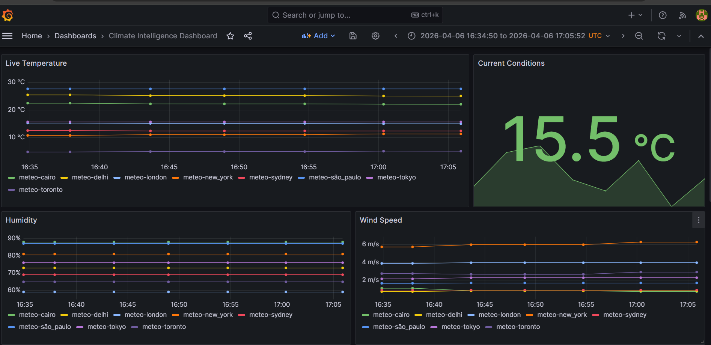
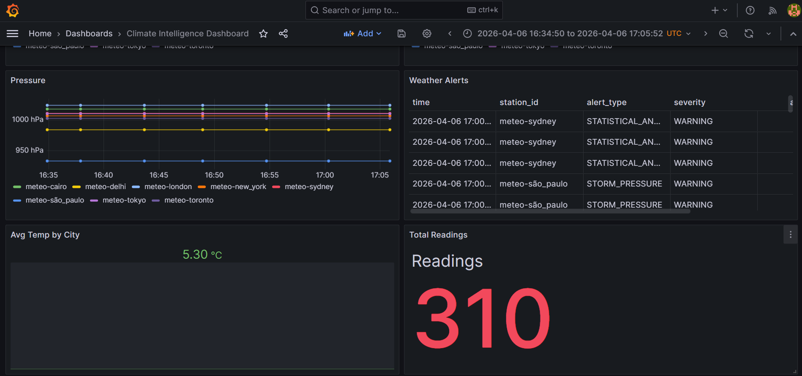

# 🌦️ Climate Intelligence Pipeline

Real-time weather data pipeline streaming data from OpenWeatherMap & Open-Meteo into TimescaleDB via Kafka, with Grafana dashboards and anomaly detection.

**Stack:** Kafka (KRaft) • TimescaleDB • Python • Grafana • Docker Compose

---

## ⚡ Features

- Real-time data ingestion from multiple weather APIs
- Kafka-based streaming (no Zookeeper required)
- TimescaleDB hypertables for time-series optimization
- Automatic hourly/daily aggregations
- Z-score anomaly detection
- Interactive Grafana dashboards
- 8 major cities monitored globally
- Production-ready with health checks & auto-restart

---


## Dashboard Preview




```
API Sources (OpenWeatherMap, Open-Meteo)
                    ↓
         ┌──────────────────────┐
         │  Python Producer     │
         │  (Polls every 60s)   │
         └──────────────────────┘
                    ↓
           ┌────────┴────────┐
           ↓                 ↓
     ┌──────────────┐  ┌─────────────────┐
     │ weather-raw  │  │ weather-alerts  │
     │   (Topic)    │  │    (Topic)      │
     └──────────────┘  └─────────────────┘
           ↓                 ↓
           └────────┬────────┘
                    ↓
         ┌──────────────────────┐
         │  Python Consumer     │
         │  (Anomaly Detection) │
         └──────────────────────┘
                    ↓
         ┌──────────────────────┐
         │  TimescaleDB         │
         │  (Hypertables +      │
         │   Continuous Aggs)   │
         └──────────────────────┘
                    ↓
         ┌──────────────────────┐
         │  Grafana Dashboard   │
         └──────────────────────┘
```

---

**Prerequisites:** Docker Desktop, optional OpenWeatherMap API key (https://openweathermap.org/api)

**Windows:**
```powershell
copy .env.example .env
docker compose up -d --build
```

**Mac/Linux:**
```bash
cp .env.example .env
docker compose up -d --build
```

**Access Services:**
| Service | URL | Login |
|---------|-----|-------|
| Grafana | http://localhost:3000 | admin / admin |
| Kafka UI | http://localhost:8080 | — |

---

## 🔧 Services

1. **Kafka (KRaft)** - Message broker with `weather-raw` & `weather-alerts` topics
2. **Kafka UI** - Web interface for monitoring topics & messages
3. **Producer** - Polls APIs every 60s, publishes to Kafka
4. **Consumer** - Consumes Kafka, runs anomaly detection, writes to DB
5. **TimescaleDB** - Time-series DB with hypertables & continuous aggregates
6. **Grafana** - Pre-provisioned dashboards

---

## ⚙️ Configuration

`.env` variables:
```env
OPENWEATHER_API_KEY=your_api_key       # Leave blank for demo
POLL_INTERVAL_SECONDS=60               # Data fetch frequency
KAFKA_BOOTSTRAP_SERVERS=kafka:29092
DB_HOST=timescaledb
DB_PORT=5432
DB_NAME=climate_db
DB_USER=climate_user
DB_PASSWORD=climate_pass
```

---

## 📊 Database Tables

| Table | Purpose |
|-------|---------|
| `weather_stations` | Reference data (8 cities) |
| `weather_readings` | Hypertable with raw sensor data |
| `weather_alerts` | Anomaly detections (z-score) |
| `weather_hourly` | Continuous aggregate (auto-updated) |
| `weather_daily` | Continuous aggregate (auto-updated) |

---

## 🔍 Troubleshooting

```bash
# View logs
docker compose logs -f producer

# Check service health
docker compose ps

# Query database
docker compose exec timescaledb psql -U climate_user -d climate_db \
  -c "SELECT COUNT(*) FROM weather_readings;"

# Restart all services
docker compose down -v && docker compose up -d --build
```

---

## 💻 Local Development

**Run Producer locally:**
```bash
cd ingestion
pip install -r requirements.txt
python producer.py
```

**Query examples:**
```sql
-- Latest readings
SELECT time, city, temperature_c FROM weather_readings 
JOIN weather_stations USING(station_id) ORDER BY time DESC LIMIT 10;

-- Hourly summary
SELECT bucket, avg_temp_c, reading_count FROM weather_hourly 
WHERE station_id = 'owm-london' ORDER BY bucket DESC LIMIT 24;

-- Recent alerts
SELECT time, city, alert_type, severity FROM weather_alerts 
JOIN weather_stations USING(station_id) ORDER BY time DESC;
```

---

## 📄 License

MIT License - See LICENSE file for details

| Container          | Image                        | Role                        |
|--------------------|------------------------------|-----------------------------|
| `kafka`            | confluentinc/cp-kafka:7.6.0  | Broker + Controller (KRaft) |
| `kafka-ui`         | provectuslabs/kafka-ui       | Topic/consumer monitoring   |
| `timescaledb`      | timescale/timescaledb-pg15   | Time-series storage         |
| `weather-ingestion`| python:3.11-slim (custom)    | API polling + Kafka produce |
| `weather-consumer` | python:3.11-slim (custom)    | Kafka consume + DB write    |
| `grafana`          | grafana/grafana:10.2.0       | Dashboard + alerting        |

## Kafka Topics

| Topic             | Description                              |
|-------------------|------------------------------------------|
| `weather-raw`     | Every reading from every city (raw JSON) |
| `weather-alerts`  | Threshold + statistical anomaly alerts   |

## Useful Commands

```bash
# View logs
docker compose logs -f ingestion
docker compose logs -f consumer

# Check what's in the database
docker exec timescaledb psql -U climate_user -d climate_db \
  -c "SELECT time, station_id, temperature_c FROM weather_readings ORDER BY time DESC LIMIT 20;"

# Check alerts
docker exec timescaledb psql -U climate_user -d climate_db \
  -c "SELECT * FROM weather_alerts ORDER BY time DESC LIMIT 10;"

# Stop everything
docker compose down

# Stop and delete all data
docker compose down -v
```

```
